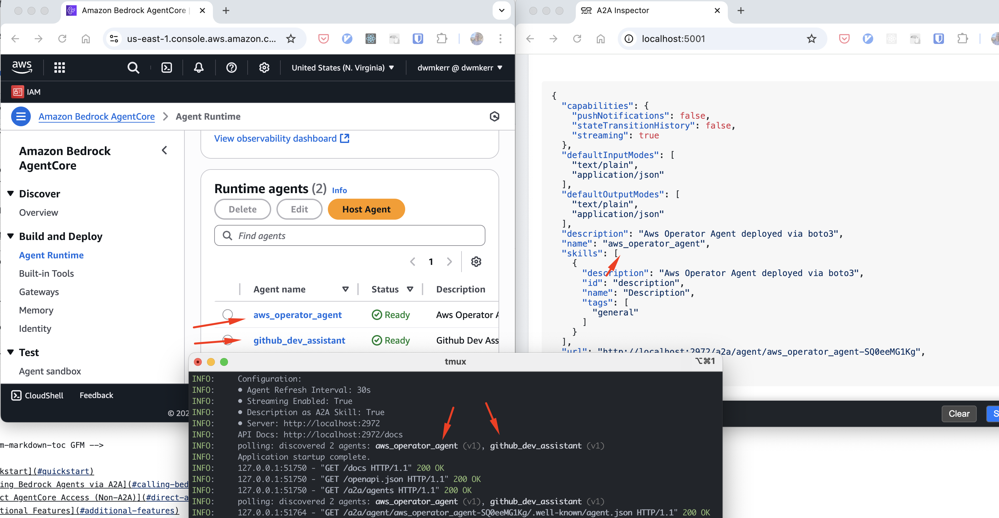

# AWS Bedrock AgentCore A2A Proxy

[](https://codecov.io/gh/dwmkerr/aws-agentcore-a2a-proxy)
[](https://pypi.org/project/aws-agentcore-a2a-proxy/)

A2A proxy server for AWS Bedrock AgentCore agents.

- Polls AWS Agentcore to discover agents
- Exposes an A2A Agent Card for each agent
- Operates as proxy, transformaing A2A calls to AWS Bedrock invocation

Each exposed agent has its own agent card and A2A address. This allows systems that do not know about Agentcore to talk to your agents.

> [!WARNING]
> This is an example of how to expose Agentcore agents via A2A, by running a simple proxy server. Agentcore is currently in tech preview. The demo deploys an AWS agent that runs with a configurable role. Be very mindful of the roles that you assign agents and the potential security consequences. 

```
┌─────────────┐    ┌─────────────────┐    ┌─────────────────┐
│   A2A       │───▶│  A2A Proxy      │───▶│   AgentCore     │
│   Client    │    │                 │    │                 │
│             │◀───│                 │◀───│                 │
└─────────────┘    └─────────────────┘    └─────────────────┘
                           │
                           ▼
                   Auto-discovers agents
                   Exposes A2A endpoints
```

The screenshot below shows some agents in Agentcore, the proxy discovering and exposing them, and the A2A Inspector connected to one of the agents:



<!-- vim-markdown-toc GFM -->

- [Quickstart](#quickstart)
- [Calling Bedrock Agents via A2A](#calling-bedrock-agents-via-a2a)
- [Direct AgentCore Access (Non-A2A)](#direct-agentcore-access-non-a2a)
- [Additional Features](#additional-features)
    - [Streaming Responses](#streaming-responses)
    - [OIDC](#oidc)
- [How It Works](#how-it-works)
- [Demo Setup (Complete Infrastructure + Agents)](#demo-setup-complete-infrastructure--agents)
- [Custom Infrastructure Setup](#custom-infrastructure-setup)
- [Permissions](#permissions)
- [Next Steps](#next-steps)

<!-- vim-markdown-toc -->

## Quickstart

The Agentcore A2A Proxy uses the AWS credential chain to discover Agentcore agents. This means you can configure explicit credentials via environment variables, use the service account, or any other configuration method.

For convenience, the server will read from `.env` if present - you can drop your AWS credentials in this file:

```bash
# Configure environment
cp .env.example .env
vi .env
```

Start the AWS Agentcore A2A Proxy with:

```bash
make dev

# Starting AWS Bedrock AgentCore A2A Proxy
# Configuration:
# • Agent Refresh Interval: 30s
# • Streaming Enabled: True
# • Description as A2A Skill: True
# • Server: http://localhost:2972
# polling: discovered 2 agents: aws_operator_agent (v11), github_dev_assistant (v12)
```

Any agents available for the user with the given credentials will be exposed. If you need to create some agents as an example, set up the required AWS infrastructure and deploy some sample agents:

```bash
# Set up demo AWS infrastructure (IAM roles, ECR, CloudWatch, etc.)
make install-demo-infrastructure

# Deploy sample agents using the infrastructure
make install-demo-agents
```

## Calling Bedrock Agents via A2A

View the API documentation:

```bash
open http://localhost:2972/docs
```

List available A2A agents:

```bash
curl http://localhost:2972/a2a/agents

# [{"agent_id": "Bedrock_Customer_Support_Agent-jQwAm25rmZ", "name": "Bedrock_Customer_Support_Agent", "host": "localhost:2972", "endpoint": "/a2a/agent/Bedrock_Customer_Support_Agent-jQwAm25rmZ", ...}]
```

Get the agent ID dynamically:

```bash
AGENT_ID=$(curl -s http://localhost:2972/a2a/agents | jq -r '.[0].agent_id')
echo "Using agent ID: $AGENT_ID"
```

Get an agent's card:

```bash
curl http://localhost:2972/a2a/agent/$AGENT_ID/.well-known/agent.json

# {"name": "Bedrock_Customer_Support_Agent", "description": "Customer support agent powered by AWS Bedrock AgentCore", "capabilities": {...}}
```

Invoke an agent via A2A:

```bash
curl -X POST http://localhost:2972/a2a/agent/$AGENT_ID/jsonrpc \
  -H "Content-Type: application/json" \
  -d '{"method": "query", "params": {"query": "Hello, I need help with my order"}, "id": 1}'

# Output: {"result": "Hello! I'd be happy to help you with your order..."}
```

## Direct AgentCore Access (Non-A2A)

For debugging or direct integration, you can also call AgentCore agents directly without the A2A protocol.

List the Agentcore agents first:

```bash
curl http://localhost:2972/agentcore/agents

# [{"agentRuntimeId": "Bedrock_Customer_Support_Agent-XLA7bpGvk5", "agentRuntimeName": "Bedrock_Customer_Support_Agent", "status": "READY", ...}]
```

Get the agent runtime ID for direct AgentCore calls:

```bash
AGENT_RUNTIME_ID=$(curl -s http://localhost:2972/agentcore/agents | jq -r '.[0].agentRuntimeId')
echo "Using agent runtime ID: $AGENT_RUNTIME_ID"
```

Then invoke:

```bash
curl -X POST http://localhost:2972/agentcore/agents/$AGENT_RUNTIME_ID/invoke \
  -H "Content-Type: application/json" \
  -d '{"prompt": "Hello, I need help with my order"}'

# {"result": {"role": "assistant", "content": [{"text": "Hello! I'd be happy to help..."}]}}
```

## Additional Features

### Streaming Responses

The A2A proxy supports streaming responses through both the A2A protocol and direct HTTP endpoints. Agents declare streaming capability in their agent cards:

```json
{
  "capabilities": {
    "streaming": true,
    "pushNotifications": false,
    "stateTransitionHistory": false
  }
}
```

You can make a streaming call like so:

```bash
# Get the agent runtime ID (using jq to extract dynamically)
AGENT_RUNTIME_ID=$(curl -s http://localhost:2972/agentcore/agents | jq -r '.[0].agentRuntimeId')

# Make streaming call
curl -X POST http://localhost:2972/agentcore/agents/$AGENT_RUNTIME_ID/invoke-stream \
  -H "Content-Type: application/json" \
  -H "Accept: text/event-stream" \
  -d '{"prompt": "Tell me a very long and detailed story about Agent-to-Agent (A2A) protocol, including its history, how it works, its benefits, and real-world applications. Please make it comprehensive and engaging."}'

# Output (streaming in real-time):
# data: {"text": "Once"}
# data: {"text": " upon"}
# data: {"text": " a"}
# data: {"text": " time"}
# data: {"text": " in"}
# data: {"text": " the"}
# data: {"text": " world"}
# data: {"text": " of"}
# data: {"text": " distributed"}
# data: {"text": " systems"}
# data: {"text": "..."}
# data: [DONE]
```

### OIDC

An OIDC demo agent that connects to GitHub is currently in progress. Raise tickets screaming for it if you want me to speed up.

## How It Works

Uses direct HTTPS calls to AgentCore (boto3 SDK not available yet). Discovers agents via `bedrock-agentcore-control` client and exposes them through standard A2A protocol endpoints. Supports both explicit credentials and default AWS credential chain.

## Demo Setup (Complete Infrastructure + Agents)

If you want to try the complete demo with managed infrastructure and agents:

```bash
# Set up demo infrastructure (IAM roles, ECR, CloudWatch, etc.)
make install-demo-infrastructure

# Deploy demo agents using the infrastructure
make install-demo-agents

# Clean up everything when done
make uninstall-demo-infrastructure
```

The demo infrastructure includes:
- IAM execution role for AgentCore agents
- ECR repository for container images
- User policies for agent invocation  
- CloudWatch log groups with retention
- Bedrock model logging configuration

Configure resources by editing `./demo/infrastructure/terraform.tfvars`. Note these resources incur AWS costs.

## Custom Infrastructure Setup

If you have your own AWS infrastructure and want to deploy agents to it:

1. **Set environment variables:**
   ```bash
   export AWS_ACCESS_KEY_ID=your_key
   export AWS_SECRET_ACCESS_KEY=your_secret
   export AWS_REGION=us-east-1
   export IAM_ROLE_ARN=arn:aws:iam::123456789012:role/YourAgentRole
   export ECR_REPOSITORY_URL=123456789012.dkr.ecr.us-east-1.amazonaws.com/your-repo
   ```

2. **Deploy specific agents:**
   ```bash
   cd demo/agents/customer-support-agents
   make install    # deploy agent
   make uninstall  # remove agent
   ```

This creates a customer support agent with order lookup and knowledge base capabilities.


## Permissions

Requires IAM permissions:

- `bedrock-agentcore:ListAgentRuntimes`
- `bedrock-agentcore:DescribeAgentRuntime` 
- `bedrock-agentcore:InvokeAgentRuntime`

## Next Steps

- Streaming test end to end
- OIDC
